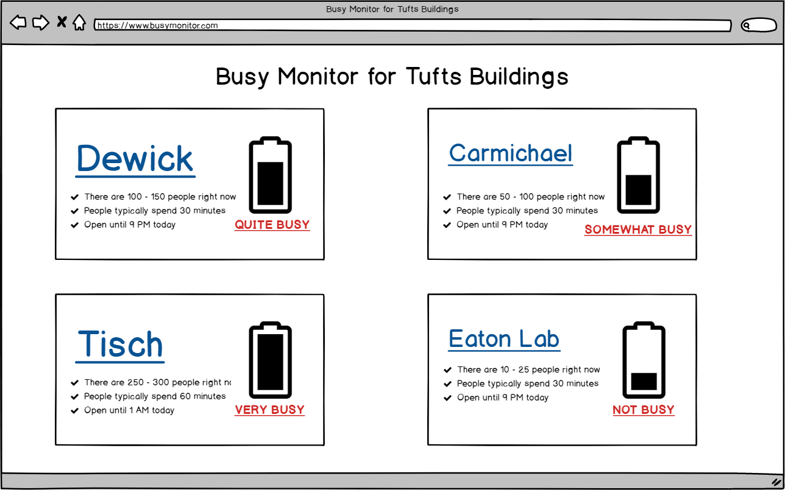
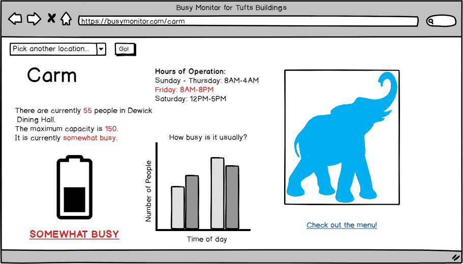
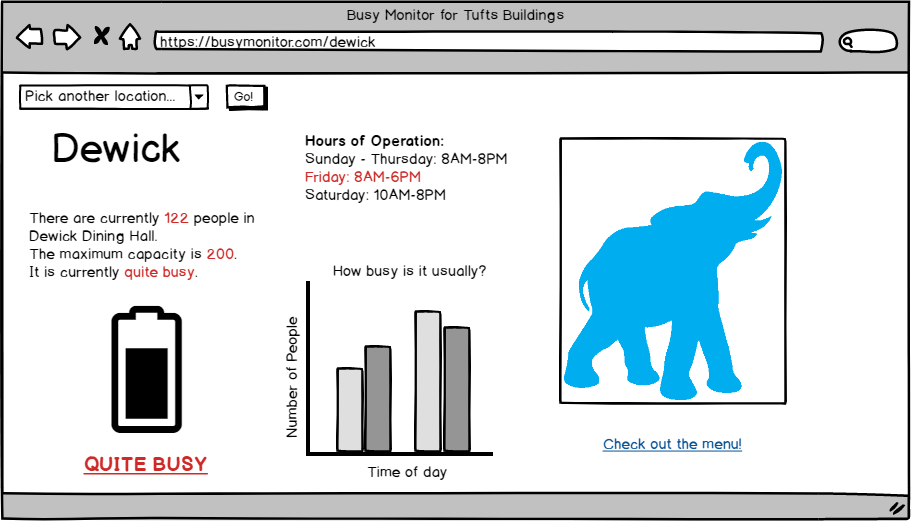
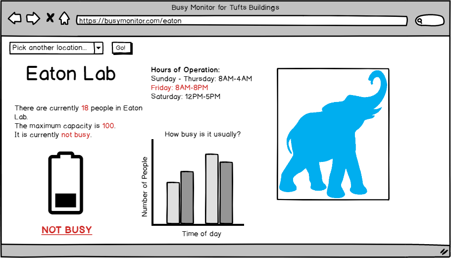
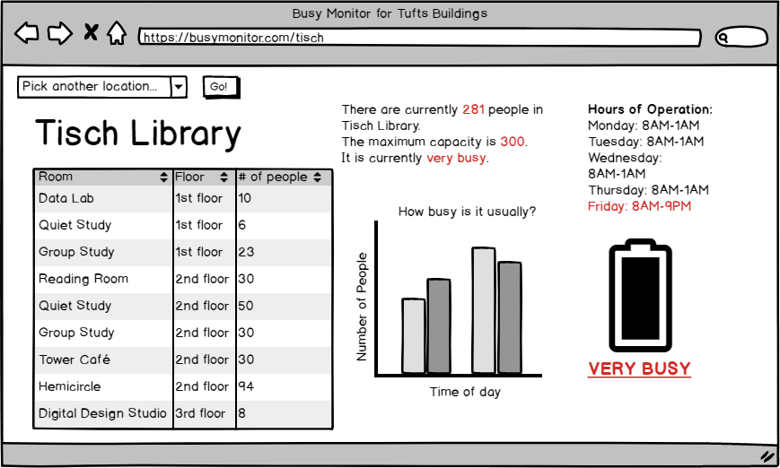

# Busy Monitor #

## Problem Statement ##

We want to give people the opportunity to know what places on Tufts campus (i.e. dining halls, Tisch, and Eaton Lab) are currently busy or quiet from wherever they are. This will save student's time and energy.

## How to solve the problem ##

* There are multiple ways we thought of to approach this problem
* Measuring network traffic
  	* Potential complications: 
	  	* we need to catalogue the router number for each building that we are interested in tracking; specifically for Carm, it may be hard to distinguish between people in the dining hall vs. people in the residential area; 
		* some people may use no internet device(s), while others may use multiple devices
* Staff members count the numbers of people in a building (mainly libraries and labs)
	* Create simple software that would allow staff to upload that data to us
	* Potential complications:
		* reliance on human element
		* numbers often boosted by 5-6 people
* Count swipe ins
	* Potential complications:
		* How do you know how quickly people leave?
		* Will we be granted access to that information?
	* Final Result:
		* It took us approximately a month to be granted access to swipe-in information. Given the time-constraint of this project, we decided to not use this data.
* Use google’s busy API
	* https://github.com/m-wrzr/populartimes
	* https://developers.google.com/places/web-service/details 
	* This ended up being [against Google's policies](https://developers.google.com/terms/api-services-user-data-policy)
* Use ARP Scan
	* https://github.com/royhills/arp-scan
	* https://github.com/tuftsdev/comp20-s2018-team1/blob/master/app.json
	* https://github.com/tuftsdev/comp20-s2018-team1/blob/master/arp-scan_results.png
	* Final Result:
		* ARP Scan ended up being too complicated for the scope of this project.
* So what did we end up using?
	* Upon learning that we were unable to reliably use any of the methods above, we decided to fudge our data "real-time," as per Ming's advice. That is, we populated a database of how many people there are in each locations based on prior past staff member uploads. Then, we pushed the attendance data for each locations at each hour (or we pushed static data over "real-time"). 

## List of features ##
* Online submission form (see post/submit under https://github.com/tuftsdev/comp20-s2018-team1/blob/master/index.js)
	* This allows someone to submit information into the database regarding how many people are in a specified location at a given time. This information then has the potential to be used to provide more accurate estimates of a location's popularity. 
* Daily Menu for Dewick and Carm, thanks to [Derick Yang's Tufts Dinig API](http://dyang108.github.io/projects/2016/03/tufts-dining-api)
	* In the Dewick and Carm detail pages, there is a collapsible menu section. Users can toggle these sections to see what each dining hall is serving that day.
* Data that we display for each location:
	* Hours of Operation (from Monday to Sunday)
	* How busy the place currently is
	* How long people typically spend there
	* Graphical representation of how many people there are today (via CanvasJS)

## Data Used and Collected ##
* We managed to collect data from Eaton Lab and Tisch Library at the end of each week. Given that it would be impossible to use this data to provide real-time data, we ultimately used the data that we collected as basis for attendance estimation, to answer questions such as:
	* How many people are at location x?
	* What is the capacity of location x?
	* When are usually the busiest times? The least busiest times?
	* How busy is it right now?
* Hours of operation for each location
* Daily menus for Dewick and Carmichael Dining Halls

## Algorithms and Special Technique ##
* Create thresholds for separate classifications of how busy a place is
* Then compare current status to the thresholds
	* Display appropriate images and phrases based on the threshold
	* Draw graph depending on data points received
* Parse dining hall API JSON to display each food item under its correct category

## Wireframes ##
Homepage:

Detail pages:

### Comments by Ming
* Excellent problem
* "How many unique IPs are on the network right now at each location?" => this will be tricky to do. Don't aim for accuracy, good enough is good enough.
* Expand on your list of features, the "whats".  You alluded to a lot of this in the previous section
